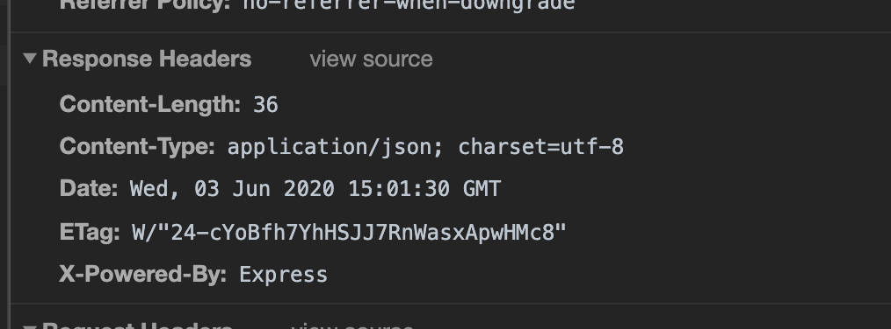
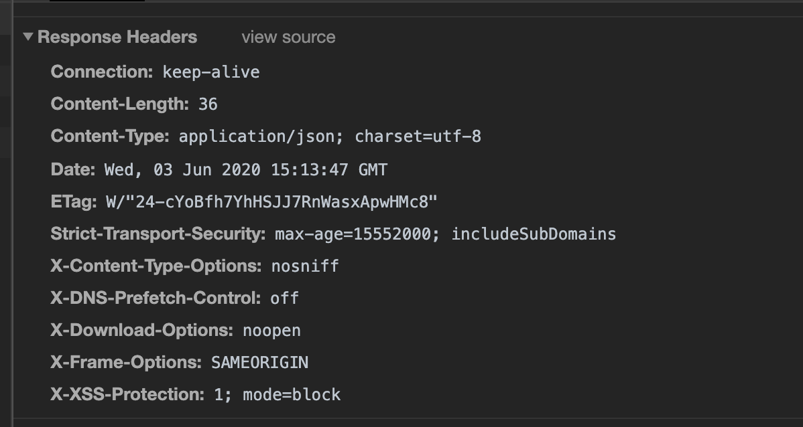

### 1. Create a basic express app with an endpoint /user support GET operation

### 2. Default headers in the normal express app is as shown below:


### 3. X-Powered-By header : Attacker can use this header to detect that app is running using Express and then launch specifically targeted attacks
```js
app.disable('x-powered-by');
```

### 4. Add a helmet middleware and notice the response headers

+ Helmet middleware by default disables the X-Powered-By header

### 5. Another important security header we need to be aware is Content-Security-Policy
+ This header is effectively a whitelist of things that are allowed to be on your page
+ We can whitelist JavaScript, CSS, Images, plugins, and much more

+ Let us say if we have a website that links no external resources at all - just your stuff. Then set a header like this
```
Content-Security-Policy: default-src 'self'
```
+ Using helmet we can do this as shown below:
```js
app.use(helmet.contentSecurityPolicy({
directives: {
    defaultSrc: ["'self'"]
}
}))
```
+ Let us say if we have to allow the CSS from Bootstrap's CDN. Then this can be implemented as shown below:
```js
app.use(helment.contentSecurityPolicy({
    directives: {
        defaultSrc: ["'self'"],
        styleSrc: ["'self'",'maxcdn.bootstrapcdn.com']    
}
}))
```

### 6. Another important header is X-Frame-Options header
+ This header tells the browser to prevent your webpage from being put in a iframe
+ When the browser load iframes, they'll check the value of the X-Frame-Options header and abort loading if it is not allowed
+ Header has three options:
```
X-Frame-Options: DENY
X-Frame-Options: SAMEORIGIN
X-Frame-Options: ALLOW-FROM http://example.com
```
+ This header helps in mitigating clickjacking attacks

+ We can implement this header using helmet as shown below:
```js
app.use(helmet.frameguard({action: 'sameorigin'}))
app.use(helmet.frameguard({action: 'deny'}))

app.use(helmet.frameguard({
  action: 'allow-from',
  domain: 'http://example.com'
}))
```

### 7. Strict-Transport-Security header tells the browser to stick with HTTPS and never visit the insecure HTTP version
+ Once a browser sees this header, it will only visit the site over HTTPS for the next 60 days
```
Strict-Transport-Security: max-age=518400
```
+ By default this header also includes subDomains

+ This header does not tell users on HTTP to switch to HTTPS, it will just tell HTTPS users to stick around

+ Now to use this using helmet we can use code snippet as shown below:
```js
const sixtyDaysInSeconds = 518400;
app.use(helmet.hsts({
    maxAge: sixtyDaysInSeconds
}))
```

### 8. X-Content-Type-Options header tells browser not to sniff MIME types
+ If this header is set to nosniff, then browser won't sniff MIME type -  they will trust what the server says and block the resource if it's wrong

+ Using helmet we can set the X-Content-Type-Options header to nosniff
```js
app.use(helmet.noSniff());
```

### 9. Referrer header is set by web browsers to tell the server where the request is coming from
+ For example if you click a link on example.com/index.html and if it takes you to wikipedia.org, then Wikipedia's servers will see
```
Referer: example.com
```
+ Now this can have a privacy implications - websites can see where the users come from
+ The new Referer-Policy Http header lets authors control how browsers set the Referer header
+ Possible directives for this Referer are 
```js
enum ReferrerPolicy {
  "",
  "no-referrer",
  "no-referrer-when-downgrade",
  "same-origin",
  "origin",
  "strict-origin",
  "origin-when-cross-origin",
  "strict-origin-when-cross-origin",
  "unsafe-url"
}
```

+ To set the referer policy to same-origin use the following code
```js
app.use(helmet.referrerPolicy({policy: 'same-origin'}))
```

### 10. X-XSS-Protection header which prevents the XSS attacks
+ Using helmet we can set this header as shown below
```js
app.use(helmet.xssFilter());
```
+ Sets "X-XSS-Protection: 1; mode=block"
